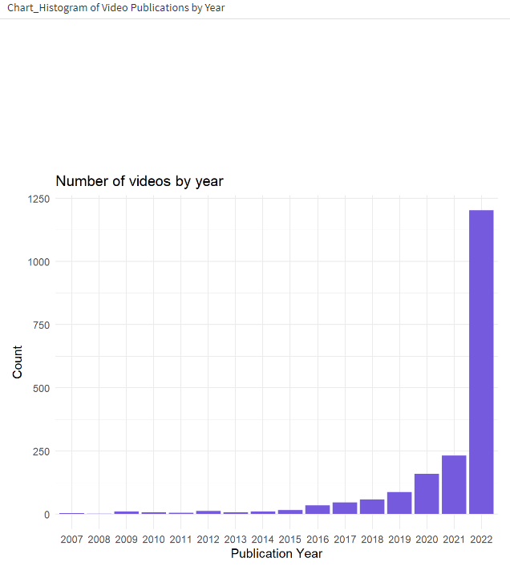
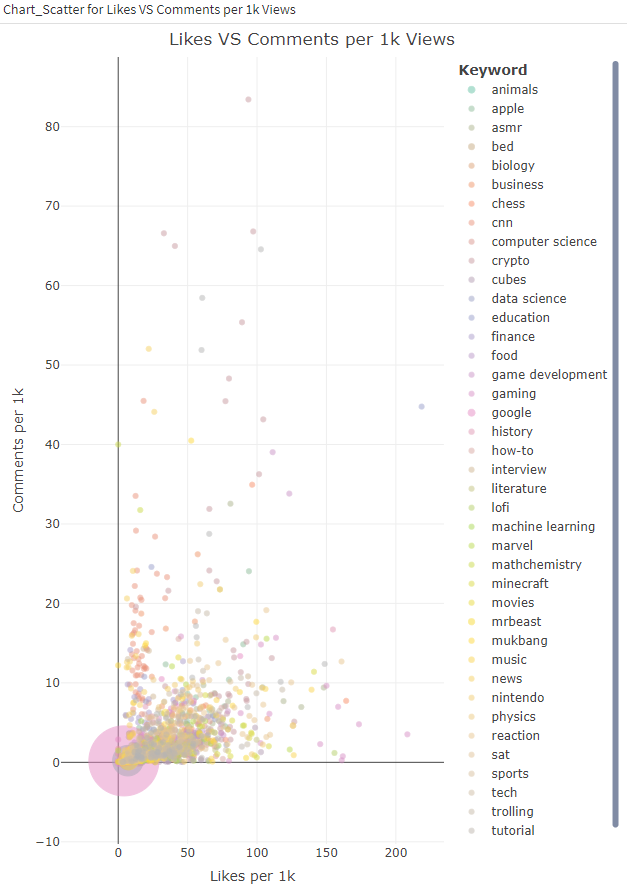

# Sales Analysis
This is an Exploratory Data Analysis R project for Youtube Video Trends. It includes a dashboard that shows some insights from the analysis.

# About Data
Data includes:
* Video Title

* Video ID

* Video Publication data

* Likes
 
 * Comments
 
 * Views

 * Keywords (Content Category)

## Dashboard Highlights

